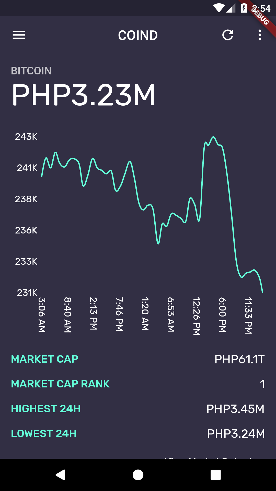

# coind

A cryptocurrency app for viewing the current information about the cryptos.

## Brief History

Recently, there was an itch to try something new, something very different from native Android development and web development. I heard of Flutter since it was announced, but didn't bothered to explore it due to its syntax and the programming langauge that came along with it. I was reluctant in trying out another cross-platform framework on building mobile applications; mainly due to the poor developer experience I had with Xamarin. Fastforward recently, I've learned the basics of ReactJS and its syntax, the state management approach was very new to me, since I am primarily learning native Android; however, I liked the concepts of React, and began finally learning Flutter. Since the play-to-earn game Axie Infinity was very popular in my home country; I decided to try building a Flutter app that shows the current prices of the cryptocurries. This is a very simple app that pulls data from CoinGecko and displays them to the user, both in the main UI and Android's home screen widgets. I had fun learning flutter and doing this app so I hope you enjoy.

## Screenshot

## Built With
* Flutter
* Dart

## Versioning

We use [SemVer](http://www.semver.org) for versioning. For the versions available, see the [tags on this repository](https://github.com/asayah-san/fokus-android/tags)

## Licenses

This project is licensed under the GPL-3.0 - see the license file for more details

## Contributing

This is an open-source personal project and I am very happy to accept community contributions. Open a PR to get started.
